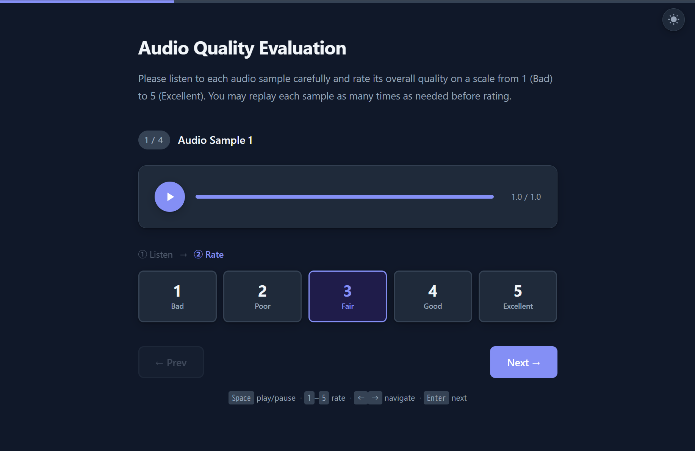
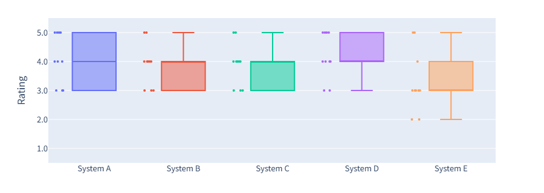

# Listen and Rate

A lightweight, self-hostable tool for conducting subjective listening tests in a browser.
Simply prepare your audio files and a YAML configuration file, and you're ready to run your experiment.
A screenshot of the interface is shown below.

<p align="center">
  
</p>

## Key Features

- **Configuration-Driven**: Define experiments in a single YAML file.
- **Dual Backend Support**: Choose the deployment option that fits your environment.
  1. PHP: Drop a static bundle into your `public_html` or `www` directory.
  1. FastAPI: Run it as a lightweight Python backend server.
- **Built-in Analytics**: Analyze experimental results directly in your browser without external plotting or statistical analysis tools.

## Supported Tests

- **MOS**: Rate each stimulus on a 1-5 scale.
- **DMOS**: Rate the degradation of each stimulus on a 1-5 scale.
- **CMOS**: Compare two stimuli and rate the degree of preference on a -3 to +3 scale.
- **AB**: Compare two stimuli and choose the preferred one.
- **ABX**: Determine whether the third sample (X) matches sample A or B.
- **XAB**: Determine whether the first sample (X) is closer to sample A or B.
- **MUSHRA**: Compare multiple stimuli and rate each on a 0-100 scale.

## Requirements

- Python 3.11+
- [uv](https://docs.astral.sh/uv/) 0.9.17+

## Installation

If you don't have `uv`, install it first.

```sh
curl -LsSf https://astral.sh/uv/install.sh | sh
```

Then, install the required dependencies by running:

```sh
make setup
```

## Usage

### 1. Writing a configuration file

An experiment is defined by a single YAML configuration file.
The easiest way to get started is to copy one of the example configurations in `examples/` and edit it.
Each example is fully commented, including optional settings that are not covered in this README.

Here's what a typical MOS configuration looks like:

```yaml
test_type: mos

title: "Audio Quality Evaluation"

instructions: |
  Please listen to each audio sample carefully and rate its overall quality
  on a scale from 1 (Bad) to 5 (Excellent).
  You may replay each sample as many times as needed before rating.

output:
  format: csv
  path: ./results/

stimuli_dirs:
  # utterances_per_session: 1
  systems:
    - path: ./stimuli/examples/A
      system: A
    - path: ./stimuli/examples/B
      # system: B  # inferred from the basename of `path`
```

> [!IMPORTANT]
> Filenames must match across all system directories.
> Files that are missing from any directory are excluded from the experiment (a warning is shown when the configuration is loaded).

> [!TIP]
> If you don't want every listener sitting through the entire stimulus set, `utterances_per_session` limits how many utterances each listener is presented with.
> For example, setting it to `1` in a two-system experiment means each listener evaluates a single utterance (one pair of stimuli).

### 2.A. PHP deployment

Choose this option if you already have PHP web hosting, such as a shared hosting service with FTP access but no shell access.

Start by running:

```sh
make export CONFIG=/path/to/your/config.yaml DEPLOY=/path/to/your/public_html/my-test
```

This creates a self-contained `my-test/` directory containing your configuration, stimuli (as symbolic links), and the required PHP scripts.
Open the experiment URL in your browser or share it with your participants.

To update the experiment, regenerate the bundle with

```sh
make export-force CONFIG=/path/to/your/another_config.yaml DEPLOY=/path/to/your/public_html/my-test
```

This replaces the exported files while preserving any results that have already been collected.

### 2.B. FastAPI deployment

Choose this option if you can keep a Python process running, for example on an internal network or a small VM.
Unlike the PHP deployment, the configuration is served directly, so no export step is required.

Start the server by running:

```sh
make serve CONFIG=/path/to/your/config.yaml
```

Then open <http://localhost:8000> in your browser to access the experiment.

To use a different host or port, specify them as Make variables:

```sh
make serve CONFIG=/path/to/your/config.yaml HOST=127.0.0.1 PORT=8080
```

### 3. Analyzing results

Results are stored in a subdirectory named after the configuration file, with one file per session:

```text
results/
└── config/  # basename of your config file
    ├── 0009b4f1-b002-4ff2-998a-5694d7f916c5.csv
    ├── 12c23f42-3ade-4a43-9ff0-f1f6514b38df.csv
    ├── ...
```

For the PHP deployment, the results live inside the exported bundle.
For example, you can generate a self-contained HTML report with:

```sh
make report CONFIG=/path/to/your/config.yaml DEPLOY=/path/to/your/public_html/my-test
```

This writes the report to `/path/to/your/public_html/my-test/results/config/report.html` in this case.
The report includes interactive Plotly visualizations, summary statistics, etc.
Open the generated HTML in your browser to view the report.

For the FastAPI deployment, simply run:

```sh
make report CONFIG=/path/to/your/config.yaml
```

To customize the report settings, specify a report configuration file:

```sh
make report CONFIG=/path/to/your/config.yaml REPORT_CONFIG=examples/report-config.yaml
```

The figure below is an example from a generated report.

<p align="center">
  
</p>

## Limitations

> [!IMPORTANT]
> Randomization is independent across listeners.
> Trial and stimulus order are randomized independently for each listener.
> This tool does not use a Latin-square or any other counterbalanced design across sessions.
> If your study requires guaranteed counterbalancing, you will need to prepare the assignment yourself.

> [!IMPORTANT]
> Blinding is intended for honest participants.
> The browser never receives system names, file paths, or which stimulus the hidden reference matches.
> However, preventing a determined user from inspecting browser memory or network traffic is outside the scope of this tool.

## License

Released under the MIT License.
See [LICENSE](LICENSE) for details.
